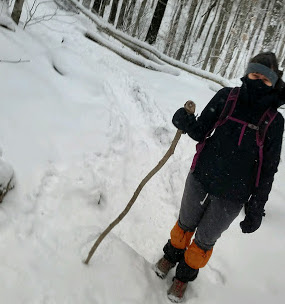

```{r, include = FALSE}
library(ggplot2)
library(dplyr) 
```

## Who Am I? 

Hi! My name is Dr. Elizabeth Sweeney. I am currently an Assistant Professor in the Biostatistics division at Weill Cornell and today marks my 4th day on the job! The journey that led me to where I am now was a little winding... 

* Senior Data Scientist at Covera Health 
* Senior Quantiative Scientist at Flatiron Health 
* Postdoctoral Fellow in Statistics Department at Rice University 
* PhD in Biostatsitics from Johns Hopkins 
* Trainee at the National Institute of Neurological Disorder and Stroke 

My research interests are in working with electronic health records (EHR) data and structural magnetic resonance imaging (sMRI) data.  When I'm not doing research I like hiking and riding my bike. 

A few fun facts about me:

* I bike commute every day that I can! 
* I once biked 100 miles in one day from Brooklyn to the Hamptons! 
* I am only 8 peaks away from hiking the Catskills 3500! 





## What is Neuroconductor? 

Here is a link to the Neuroconductor website: https://neuroconductor.org

Neuroconductor is an open-source platform for rapid testing and dissemination of reproducible computational imaging software. The goals of the project are to:

* provide a centralized repository of R software dedicated to image analysis;
* disseminate quickly software updates;
* educate a large, diverse community of scientists using detailed tutorials and short courses;
* ensure quality via automatic and manual quality controls; and
* promote reproducibility of image data analysis.

Based on the programming language R, Neuroconductor started with 51 inter-operable packages that cover multiple areas of imaging including visualization, data processing and storage, and statistical inference. Neuroconductor accepts new R package submissions, which are subject to a formal review and continuous automated testing.

In short, all of the good packages for doing brain image analysis in R are hosted on Neuroconductor! 

## The Core Team of Neuroconductor?

Neuroconductor was developed at Johns Hopkins. The Core Team of Neuroconductor includes:

*John Muschelli, R package guru 
*Adi Gherman, Lead developer 
*Brian Caffo, Professor 
*Ciprian Crainiceanu, Professor 


## How to Install Neuroconductor

You can install neuroconductor using the commands below.  If you need more assistance please visit the instructions at the link below: 

https://neuroconductor.org/tutorials/install


```{r}
##installation of neruoconductor requires the installation of the package 'devtools' 
install.packages('devtools', repos = "http://cran.us.r-project.org")

##code to install nueroconductor 
source("https://neuroconductor.org/neurocLite.R")
```

## How to Install a Package with Neuroconductor

Let's use neuroconductor to install all of the packages we will need for this tutorial. Note that I have commented out the 'neuro_install' command as this did not play well with an Rmarkdown document :(  When you are working on your own please remove the commenting out and install all of these packages from Neuroconductor. 


* oro.nifti is a basic package for image manipulation (reading, writing etc.)

```{r}
#neuro_install('oro.nifti')
library(oro.nifti)
```

* fslr is a package that we will use for image pre-processing 

```{r}
#neuro_install('fslr')
library(fslr) 
```


* WhiteStripe is a package that we will use for intensity normalization of images 

```{r}
#neuro_install('WhiteStripe')
library(WhiteStripe)
```


* oasis is a package for multiple sclerosis (MS) lesion segmentation that I wrote! 

```{r} 
#neuro_install('oasis')
library(oasis)
```


## Neuroimaging Informatics Technology Initiative (NIfTI) File Format

Much of neuroimaging data is stored in a NIfTI file format.  These files have a .nii or .nii.gz extension.

* Standardized representation of images
* Most commonly used type of analytic file
* Developed to facilitate cross-platform, cross-software interpretability
* 3-dimensional (3D) array: stacking individual slices on top of each other


## The Package oro.nifti Works with NIfTI Files 


The R package oro.nifti:

* Use the writeNIfTI, readNIfTI functions in the oro.nifti package
* Reads and writes NIfTI files
* Works with nifti R objects (S4 objects)
* Default for writeNIfTI is to save compressed NIfTI files


We will use a subject from the Kirby 21, an open source multi-modal sMRI reproducibility study with 21 healthy subjects (www.nitrc.org/projects/multimodal) to show what we can do with the oro.nifti package: 

We start by using the 'readNIfTI' function to read in the baseline T1-weighted sMRI from the Kirby 21 study.  A T1-weighted sMRI is one modality of sMRI; we will see more modalities later in the tutorial. 

```{r}
MPRAGE_base <- readNIfTI('SUBJ0001-01-MPRAGE.nii.gz', reorient=FALSE)

```

The image is stored as an 3-dimensional array. Each element in the array is referred to as a 'voxel'.  Each voxel takes on a numeric value. 

```{r}
dim(MPRAGE_base)
```

We can get header information from the image.  This tells us information about how the image was acquired on the MRI scanner and how it is stored. 
```{r}
MPRAGE_base
```

A nifti R object is an S4 object.  Let's check out the slot names for the S4 object. 

```{r}
slotNames(MPRAGE_base)

```

## Visualizing images with the base R image function 

We can visualize a single slice of the image in different orientations using the 'image' function in R. 


```{r}
##axial slice##
image(MPRAGE_base[,,128])
```

```{r}
##coronal slice##
image(MPRAGE_base[,128,], col = rainbow(12))
```

```{r} 
##sagittal slice##
image(MPRAGE_base[85,,], col = topo.colors(12))
```

## Visualizing images using the orthographic function (from the oro.nifti package)

These graphics that we made with image are just okay... Let's use the 'orthographic' function from the oro.nifti package to make better looking graphics. 

```{r}
orthographic(MPRAGE_base)
```

The default of the orthographic function is to take the middle slice in each direction (coronal, sagital and axial direction).  We can also pass in the slices which we would like to use: 

```{r} 
orthographic(MPRAGE_base, xyz = c(90, 100, 15))
```

## Make a histogram of the data 

The sMRI image is just a 3-dimensional array of numbers. Let's look at a summary of the data in the image. 

```{r}
summary(MPRAGE_base)
```

We can also use regular plot functions to do things like make histograms of the data. 

```{r} 
ggplot.MPRAGE.object <- data.frame(intensities = c(MPRAGE_base)) 

ggplot(ggplot.MPRAGE.object, aes(x = intensities)) + 
  geom_histogram() 

```

Most of the intensities in the background of the image are set to 0, we can remove these to get a better histogram.

```{r}
ggplot.MPRAGE.object.no.zeros <- ggplot.MPRAGE.object  %>% 
  filter(intensities > 0)

dim(ggplot.MPRAGE.object)

dim(ggplot.MPRAGE.object.no.zeros)

ggplot(ggplot.MPRAGE.object.no.zeros, aes(x = intensities)) + 
  geom_histogram() 

```

##Motivation for image pre-processing 

Let's read in a follow-up image from the Kirby 21 dataset for this same subject. 

```{r}
MPRAGE_follow <- readNIfTI('SUBJ0001-02-MPRAGE.nii.gz', reorient = FALSE)
```

We can view the baseline and follow-up images side by side using the 'double_ortho' function from fslr 
```{r}
double_ortho(MPRAGE_base, MPRAGE_follow)

```


We might be curious what the difference between these two images is.  We can subtract the two images and see: 

```{r} 
MPRAGE_diff <- MPRAGE_base - MPRAGE_follow
```

Note that the subtraction of the two images is still a nifti R object 
```{r}
MPRAGE_diff 
```
Visualize the difference of the two images: 
```{r}
orthographic(MPRAGE_diff )
```

The images are not exactly aligned -- which creates this ghosting effect.  To assess true differences we need to do some image pre-processing. 


##The fslr package for preprocessing data 

Here is a link to the information about the fslr package: https://neuroconductor.org/package/fslr

FSL is useful, open-source, scriptable software for neuroimaging analysis.  One of the main problems with using FSL is that it requires coding in bash. The solution is to use the fslr package.  The fslr package ports many of the main functions of FSL into R.  A Big Disclaimer: May not work on Windows operating systems! 

To use fslr you first need to install FSL. Here are the steps to install FSL and start using it with fslr (note that we have already installed the fslr package in this tutorial). 

* Install FSL
http://fsl.fmrib.ox.ac.uk/fsl/fslwiki/FslInstallation#Installing_FSL
* Set your path to FSL in R with options(fsl.path = "/your/path/fsl")


The steps of image processing are outlined below: 

* Inhomogeneity correction 
* Skull stripping 
* Registration 
* Intensity Normalization 

###Inhomogenity correction 

The first step that we will do is to remove any image Inhomogeneity.  Image inhomogeneity is background image intensity variation that is caused by imperfections in imaging devices.  This is the first step of our image pre-processing pipeline 


To use FSL, I first need to set my options to my FSL path 
```{r}
options(fsl.path= "/usr/local/fsl")

```

Now I am ready to use the 'fsl_biascorrect' function to do the inhomogeneity correction.  Note that we won't do this during the tutorial as it takes some time to run the algorithm! 

```{r}
## MPRAGE_base_bias_corrected <- fsl_biascorrect(MPRAGE_base) 

## writeNIfTI(MPRAGE_base_bias_corrected, filename = 
##            'SUBJ0001-01-MPRAGE_bias_corr', verbose = TRUE, gzipped = TRUE)

## MPRAGE_follow_bias_corrected <- fsl_biascorrect(MPRAGE_follow) 

## writeNIfTI(MPRAGE_follow_bias_corrected, filename = 
##            'SUBJ0001-02-MPRAGE_bias_corr', verbose = TRUE, gzipped = TRUE)


```

We will now read in the inhomogeneity (or bias corrected) image.  We will subtract it from the original image to see the removed inhomogeneity. 

```{r}
## read in the bias corrected baseline image 
MPRAGE_base_bias_corrected <- readNIfTI('SUBJ0001-01-MPRAGE_bias_corr.nii.gz', reorient=FALSE)

##take a difference between the bias corrected image and the original image 
bias_diff <- MPRAGE_base_bias_corrected  - MPRAGE_base

##visualize the difference 
orthographic(bias_diff)
```


###Skull stripping 

Skull stripping removes unwanted tissue (the skull, neck, etc.) and leaves behind only the brain. 

We now perform skull stripping with fslbet 
```{r}
MPRAGE_base_bias_corrected_stripped <- fslbet(MPRAGE_base_bias_corrected) 
```

We can see some of the inner workings of the fslr package by looking more closely at the fslbet command.  We can see how fslr uses system calls to call FSL.  

```{r}
fslbet
```

Let's return to our skull stripped image. We can plot the stripped image next to the original image using the 'double_ortho' function: 

```{r}
double_ortho(MPRAGE_base, MPRAGE_base_bias_corrected_stripped)
```

We can also make a 'brain mask' from the skull stripped image 

```{r}
bet_mask <- niftiarr(MPRAGE_base_bias_corrected_stripped, 1)
is_in_mask = MPRAGE_base_bias_corrected_stripped>0
bet_mask[!is_in_mask]<-0
```

We can plot the brain mask. 

```{r}
orthographic(bet_mask)
```


We can now make a histogram of just the data after skull stripping.  

```{r}
##add the brain mask to our dataframe 'ggplot.MPRAGE.object'
ggplot.MPRAGE.object$bet_mask <- c(bet_mask)

##filter the data frame for voxels that take a value 1 in the brain mask 
ggplot.MPRAGE.object.masked <- ggplot.MPRAGE.object %>% 
  filter(bet_mask == 1)

## plot the histogram of the data 
ggplot(ggplot.MPRAGE.object.masked, aes(x = intensities)) + 
  geom_histogram() 

```
Or we can make a density plot, where we can see two distinct peaks one for gray matter and one for white matter!  
 

```{r}
ggplot(ggplot.MPRAGE.object.masked, aes(x = intensities)) + 
  geom_density() 
``` 
  
  
Now we can write the brain mask using the 'writeNIfTI' function from the oro.nifti package:

```{r}
writeNIfTI(bet_mask, filename = 
             "brain_mask", verbose = TRUE, gzipped = TRUE)
```


###Image Registration 

We now register the two images.  There are many different registration algorithms that you can use with fsl (both linear and non-linear).  We will use a linear registration with flirt.  This registration has 6 degrees of freedom (roll, pitch and yaw). This is appropriate because we have a baseline and follow-up image for a patient and therefore do not need to any non-linear transformations. 


```{r}

MPRAGE_follow_bias_corrected <- readNIfTI('SUBJ0001-02-MPRAGE_bias_corr.nii.gz', reorient=FALSE)


MPRAGE_follow_reg_base <- flirt(MPRAGE_follow_bias_corrected, 
                                MPRAGE_base_bias_corrected, 
                                dof = 6, 
                                retimg = TRUE, 
                                reorient = FALSE)
```


Now we can take the difference of the baseline and follow-up images: 

```{r}
MPRAGE_reg_diff <- MPRAGE_base_bias_corrected - MPRAGE_follow_reg_base
```

And visualize this versus our original differencing without registration: 
```{r} 
double_ortho(MPRAGE_diff, MPRAGE_reg_diff)
```


### Intensity Normalization 

The next step is to intensity normalize the images.  sMRI images do not have units, so one method of normalizing these images is to put them into z-score units of the normal appearing white matter.  We do this with the R package WhiteStripe. A really nice tutorial for WhiteStripe can be found here: https://cran.r-project.org/web/packages/WhiteStripe/vignettes/Running_WhiteStripe.html/ 

```{r} 
##
ws = whitestripe(img = MPRAGE_base_bias_corrected_stripped, 
                 type = "T1", 
                 stripped = TRUE)

norm = whitestripe_norm(img =  MPRAGE_base_bias_corrected_stripped, 
                        indices = ws$whitestripe.ind)

dim(norm) 
```

When we look at the image we don't see much difference from the original image (because this is a z-score normalization, the image is just shifted and scaled).
```{r}
orthographic(norm) 

```

Where we will see a difference is in the densities of the intensities in the image. 

```{r}
ggplot.MPRAGE.object$normalized <- c(norm)


ggplot.MPRAGE.object.norm.masked <- ggplot.MPRAGE.object %>% 
  filter(bet_mask == 1)
```

Here are the original intensities 
```{r}

ggplot(ggplot.MPRAGE.object.norm.masked, aes(x = intensities)) + 
  geom_density() 

```
And here are the intensities after white stripe normalization 

```{r}

ggplot(ggplot.MPRAGE.object.norm.masked, aes(x = normalized)) + 
  geom_density() 

```


## Resources! 

Want to learn more about image pre-processing and visualization? 

* Here is a link to 'A Tutorial for Multisequence Clinical Structural MRI' in the Handbook of Neuroimaging Data Analysis: https://bit.ly/2UXakht 

* Here is a link to 'Neurohacking in R' a Coursera class with more detail on how to do neuroimaging analysis in R: https://www.coursera.org/learn/neurohacking


## Multiple Sclerosis Lesion Segmentation 

### sMRI Imaging Modalities  

So far, we have been working with T1-weighted images from the Kirby 21 study.  There are different modalities for sMRI images that produce different images.  When a person goes to have an sMRI study taken they will often have multiple sMRIs with different modalities taken of their brain.

We will now switch to a different dataset from a patient with multiple sclerosis.  The data can be found here https://github.com/muschellij2/imaging_in_r/tree/gh-pages/output/orig

Let's look at a Fluid Attenuated Inversion Recovery (FLAIR) image from a patient with Multiple Sclerosis (MS):

```{r}
FLAIR <- readNIfTI('training01_01_flair.nii.gz', reorient=FALSE)

```

The hyperintense areas of the image are brain lesions. 
```{r}
orthographic(FLAIR)

```

We can look at different slices to see more brain lesions. 

```{r}
orthographic(FLAIR, xyz = c(100, 100, 80))

```

Now let's look at the T2-weighted image 

```{r}
T2 <- readNIfTI('training01_01_t2.nii.gz', reorient=FALSE)

```


Again, lesions are hyperintense on the T2-weighted image
```{r}
orthographic(T2)

```


Now let's look at the Proton Density (PD) image 

```{r}
PD <- readNIfTI('training01_01_pd.nii.gz', reorient=FALSE)

```


Lesions are also hyperintense on the T2-weighted image. 

```{r}
orthographic(PD)

```


And we can also look at the T1-weighted image  

```{r}
T1 <- readNIfTI('training01_01_mprage_n4.nii.gz', reorient=FALSE)

```

Lesions are hypointense on the T1-weighted image. 

```{r}
orthographic(T1)

```

Next we use the 'oasis_predict' function to make a map of where the lesions in the brain are. This is an algorithm that we developed which takes a logistic regression model and trains on gold standard lesion Segmentations made by a radiologist. Different features for the logistic regression model are generated using the FLAIR, PD, T2, and T1 images. 

Link for the OASIS paper: https://www.sciencedirect.com/science/article/pii/S2213158213000235

The 'oasis_predict' function takes some time to run so again we comment this out and I have provided the output from the 'oasis_predict' function.

```{r}
##oasis_map <- oasis_predict(flair = FLAIR ,
##                           t1 = T1,
##                           t2 = T2,
##                           pd = PD)


## writeNIfTI(oasis_map$oasis_map, 
## filename = 'oasis', verbose = TRUE, gzipped = TRUE)

```

We will read in the output from the oasis_predict function. We now plot the probability map of lesion presence that is generated by oasis_predict. 

```{r}

oasis_map <- readNIfTI('oasis.nii.gz', reorient=FALSE)

orthographic(oasis_map)
```


We can binarise the probability map to create a binary map of lesion presence. 

```{r}
oasis_map_binary <- oasis_map
oasis_map_binary[oasis_map_binary >= .5] <- 1
oasis_map_binary[oasis_map_binary < 1] <- NA

```


And we can plot this over the T1-weighted image to see if we located the lesions. 

```{r}
orthographic(T1, oasis_map_binary, col.y = "orange") 

```

Let's check another set of slices to assess performance further! 

```{r}
orthographic(FLAIR, xyz = c(100, 100, 80))
```


```{r}
orthographic(T1, oasis_map_binary, col.y = "orange", xyz = c(100, 100, 80))
```